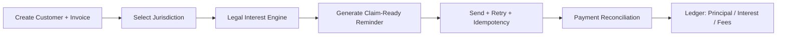

# Project Structure Visualization

## Directory Tree (target)

```text
invoice-recovery/
├── old_project/                    # archived reference implementation
├── new_project/                    # active rebuild
│   ├── architecture/
│   │   └── PROJECT_STRUCTURE.md
│   ├── docs/
│   │   └── PRODUCT_SPEC.md
│   ├── dummy-website/
│   │   ├── index.html
│   │   ├── styles.css
│   │   └── app.js
│   ├── src/
│   │   ├── app/
│   │   │   ├── (marketing)/
│   │   │   ├── dashboard/
│   │   │   └── api/
│   │   ├── core/
│   │   │   ├── jurisdiction/
│   │   │   ├── interest-engine/
│   │   │   ├── ledger/
│   │   │   └── reminders/
│   │   └── shared/
│   └── MIGRATION_NOTES.md
└── MIGRATION_MAP.md
```

## High-Level Logic Flow (Mermaid)



## Rule Priority
1. Legal correctness
2. Data integrity
3. Reliability
4. UX polish
